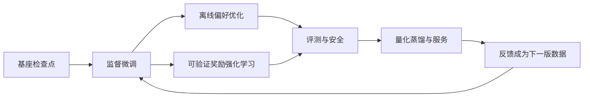
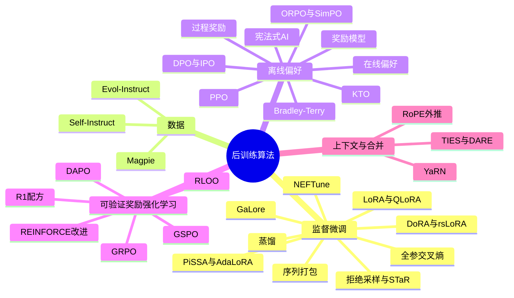
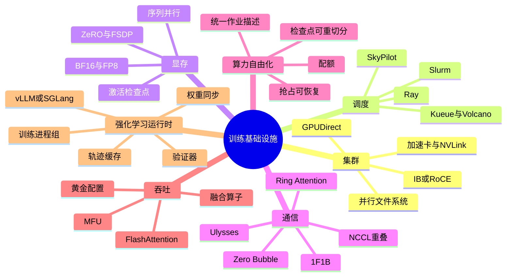
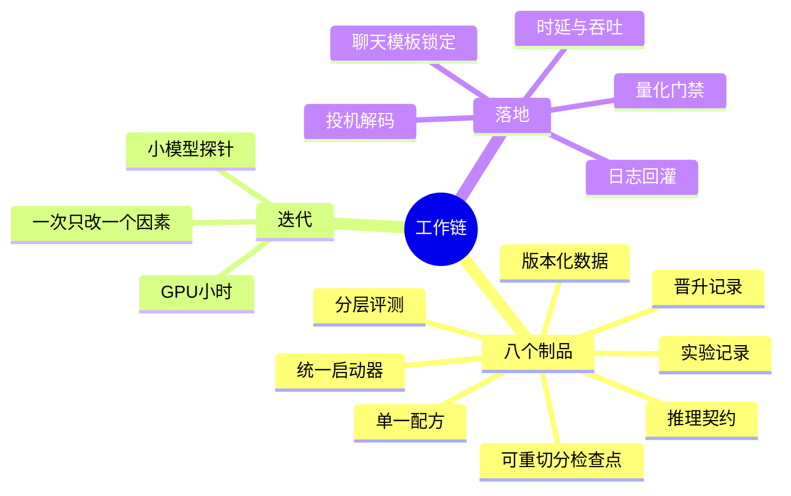

# 思维导图

可交互的全图在 [思维导图.html](思维导图.html)，用浏览器打开。下面四张 Mermaid 图是同一套结构的静态版，方便在编辑器里预览。叶子的论文和仓库在对应笔记里，不在图上重复。

## 总链

```mermaid
flowchart LR
  base[基座检查点] --> sft[监督微调]
  sft --> pref[离线偏好优化]
  sft --> rl[可验证奖励强化学习]
  pref --> gate[评测与安全]
  rl --> gate
  gate --> ship[量化蒸馏与服务]
  ship --> back[反馈成为下一版数据]
  back --> sft
```

## 后训练算法

```mermaid
mindmap
  root((后训练算法))
    监督微调
      全参交叉熵
      LoRA与QLoRA
      DoRA与rsLoRA
      PiSSA与AdaLoRA
      GaLore
      NEFTune
      序列打包
      拒绝采样与STaR
      蒸馏
    数据
      Self-Instruct
      Evol-Instruct
      Magpie
    离线偏好
      Bradley-Terry
      奖励模型
      PPO
      DPO与IPO
      KTO
      ORPO与SimPO
      在线偏好
      宪法式AI
      过程奖励
    可验证奖励强化学习
      GRPO
      RLOO
      REINFORCE改进
      DAPO
      GSPO
      R1配方
    上下文与合并
      RoPE外推
      YaRN
      TIES与DARE
```

## 训练基础设施

```mermaid
mindmap
  root((训练基础设施))
    集群
      加速卡与NVLink
      IB或RoCE
      GPUDirect
      并行文件系统
    调度
      Slurm
      Kueue与Volcano
      Ray
      SkyPilot
    显存
      BF16与FP8
      激活检查点
      ZeRO与FSDP
      序列并行
    通信
      NCCL重叠
      1F1B
      Zero Bubble
      Ring Attention
      Ulysses
    算力自由化
      统一作业描述
      配额
      检查点可重切分
      抢占可恢复
    吞吐
      MFU
      FlashAttention
      融合算子
      黄金配置
    强化学习运行时
      训练进程组
      vLLM或SGLang
      权重同步
      验证器
      轨迹缓存
```

## 工作链与落地

```mermaid
mindmap
  root((工作链))
    八个制品
      版本化数据
      单一配方
      统一启动器
      实验记录
      分层评测
      可重切分检查点
      推理契约
      晋升记录
    迭代
      一次只改一个因素
      小模型探针
      GPU小时
    落地
      聊天模板锁定
      量化门禁
      投机解码
      时延与吞吐
      日志回灌
```
